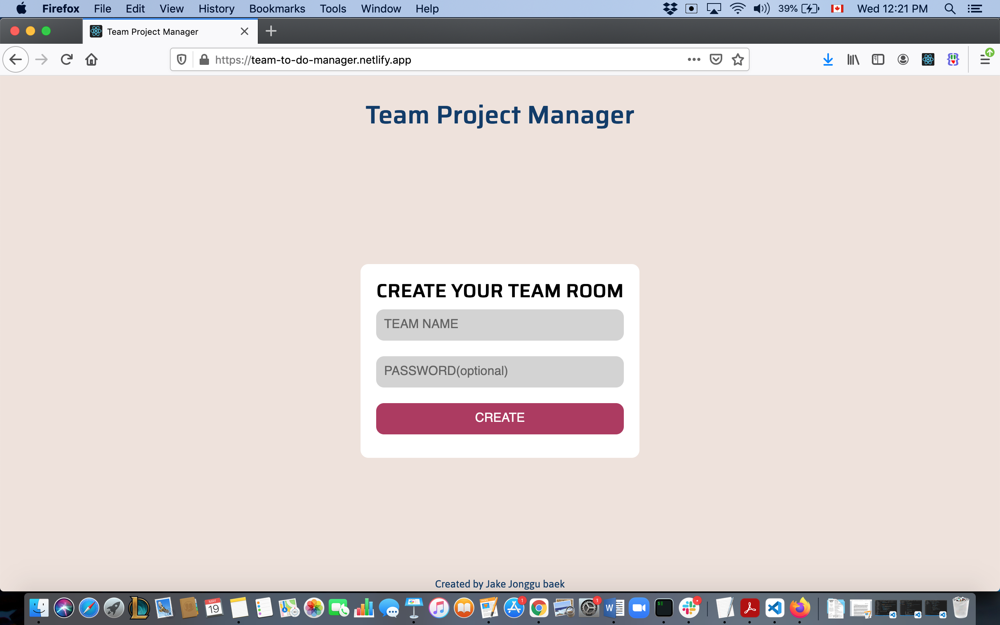
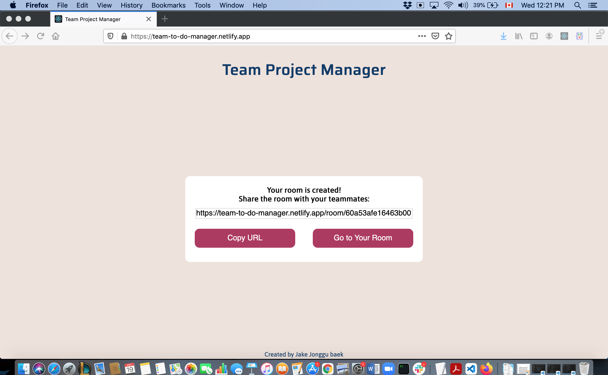
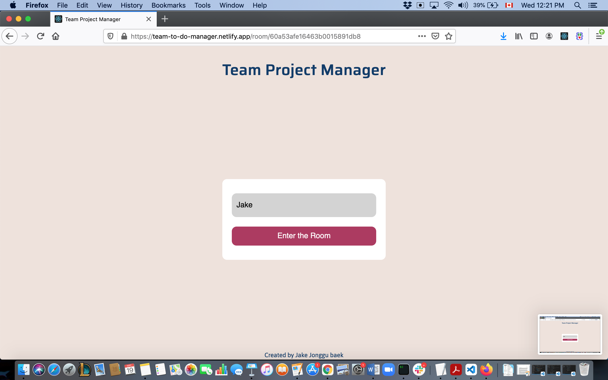
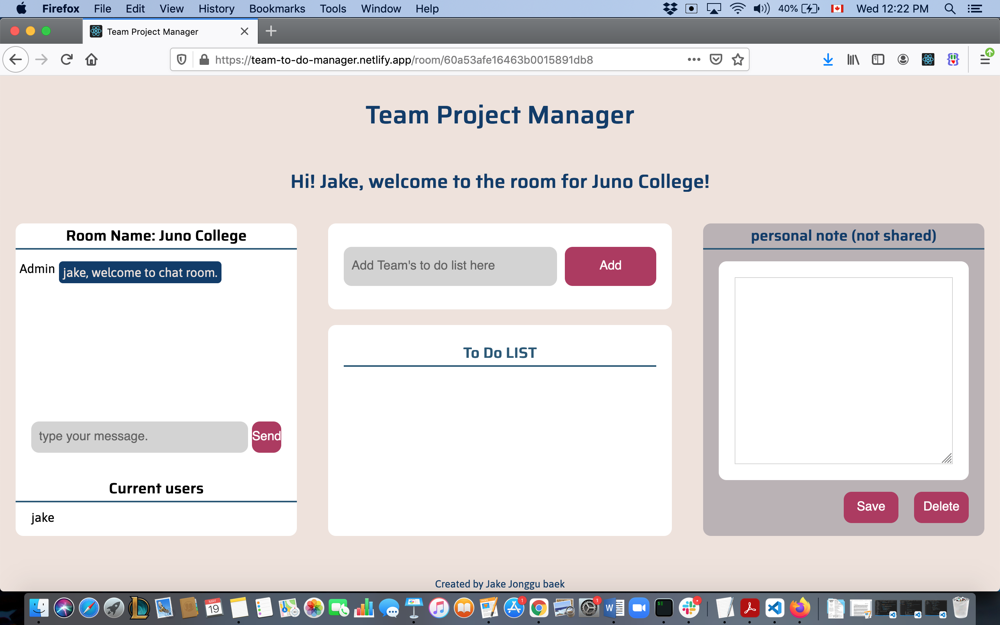

<h1 align="center">Team Project Manager</h1>

<strong>Make a to-do-list and share it with your team mates.</strong>

 

<h2>About</h2>
Single page web application built with HTML, SASS, JavaScript, React, Node.js, MongoDB, Socket.io. 
LIVE DEMO :https://team-to-do-manager.netlify.app
SERVER REPO(MongoDB):https://github.com/jakejonggubaek/to-do-list-for-group-app-server
SERVER REPO(Socket.io):https://github.com/jakejonggubaek/real-time-chat-socket.io/tree/master
 

<h2>Purpose</h2>
This application allows users to create a private room which provides to-do-list, real time chat, and personal note so that users can
manage team project with their teammates. 
 

<h2>Key features</h2>
<ul>
<li>Create Page</li>
<li>Share Page</li>
<li>Name & Password Page</li>
<li>Main Page</li>
</ul>

 

<h2>Create Page</h2>

1. Team Name: User can set the name of the room

2. Password: User can set password in order to make it more secure.

<h2>Share Page </h2>

1. URL container: URL has unique key.

2. Copy URL: Copy button so user can share it easier.

3. Go to your room: User can enter the room which was just created.

 

<h2>Name & Password Page </h2>

1. Name: User who wants to enter the room has to set up name.

2. Password: User need to type correct password if the creator set up password for the room.

 

<h2>Main Page </h2>

1. Chat section: Users can have a real time chat here. - the data (connections, disconnections, and messages) are transferred through socket.io(built in server-side with node'js / express.js)

2. To-do-list section: Anyone can add / delete to-do-list. When all the lists are completed, users can see 'complete' sign. - the data (name of each list & status of each list) are transferred to/from MongoDB through mongoose(built in server-side with node'js / express.js)

3. Personal note section: User can type personal task on this section which is not share with other team mates. - the contents typed here are stored in local storage.

 

<h2>Features to be added in the future</h2>

Scheduler

Reminder

<h2>Copyright</h2>
This project is licensed under the terms of the MIT license.